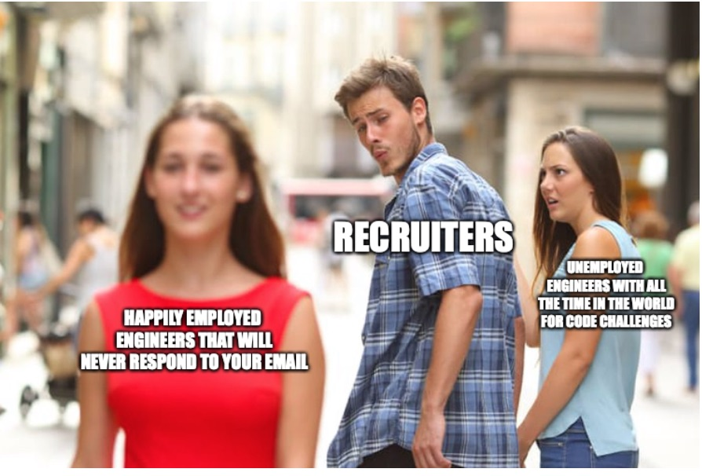
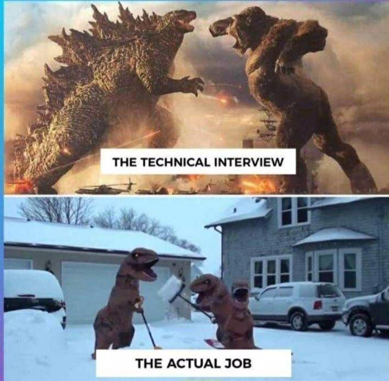
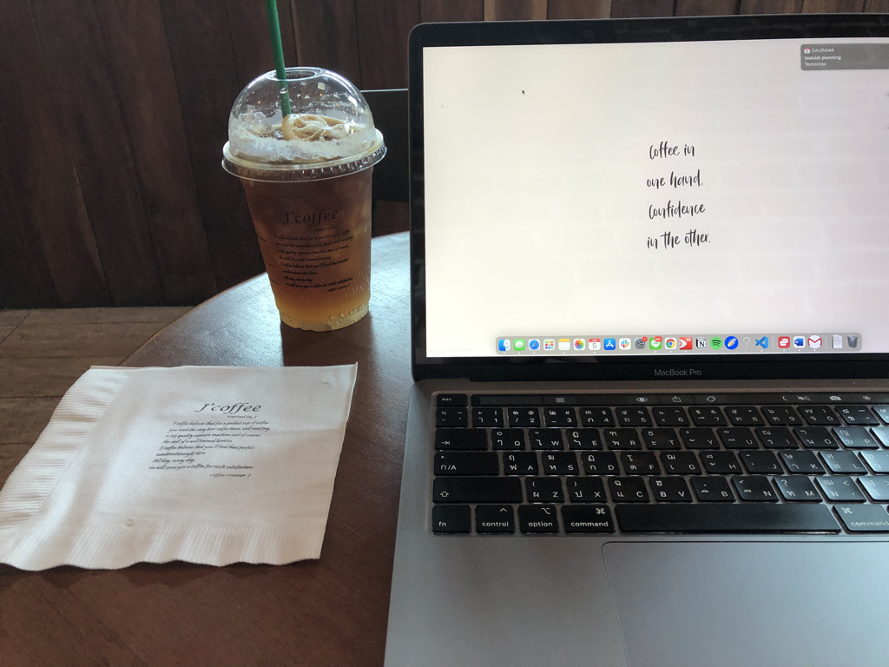

 
 
**Hi! I'm currently a full-stack developer working in Thailand for almost a year.** I went through a 2-3 months search for a developer/software engineer role a few months before I finished my bachelor's. The process was quite frustrating and lengthy, but that's probably because I wanted to ensure my priorities aligned with the job. Hence, I want to write this post to help anyone looking to land an entry-level developer role in Thailand and to provide my perspective regarding some misconceptions people might have during the job hunting/searching. Moreover, another purpose is for me to document/ reflect on how I did throughout the process. 

 
 
 

 Keep in mind that this blog is solely based on my personal experience. You might/ might not have a similar experience as I did, but I will try my best to highlight common insights / discernible patterns from my journey, so it's as beneficial as possible for people who are looking for a dev job

 
 
 

## **Pure Stats**

 
 

In total, I applied for 250-270 opportunities. My strategy back then was to apply to all the dev roles available for the new grad. I generally didn't mind whether I would be working on the front-end or backend because I sort of wanted to experience a bit of everything before specializing in anything.

So here are the exact stats.
 

* **Applied: 250+**
* Received an interview invitation: 12
* Ignored the email cuz I didn't rly wanna work there: 5
* Did an interview: 7
* Rejected: 2
* **Received a final offer: 4** 

The final 4s were IBM, Accenture, Thoughtworks, and some e-commerce startup (don't rmb the name)

 

 

## **Crappy Recruiter**

 

As you can see, I got replies back < 5% of all the applications I applied. Surprisingly, It is pretty typical as most people I know also don't usually get a reply/email back from most of the jobs they applied for. I assume it's the same for other industries as well, not just for tech, so don't be discouraged when you don't get replies back. It might have little to nothing to do with your abilities as a candidate. 

 

 

  

 One of the common issues I have encountered is recruiters/ HR usually don' get back to all the applications for various reasons. Some don't even bother checking out your CV. More often than not, they might even move on to other candidates and hang you out to dry without informing you.
 
Therefore, don't read into it too much when you don't get a reply back. You might be a stellar candidate for the position, but the recruiters, for whatever reasons, choose other candidates over you. 
 
 

 

## **Referral**

 

As I mentioned earlier with the recruiter issue, one way to workaround is getting a referral from people inside the company that you know. Most companies provide referral fees to employees who successfully refer a new hire, so they are also incentivized to refer you to their recruiters. \*\* **The best possible outcome from a referral is only landing you an interview tho, you still need to do ur part to pass interviews**. I actually got a referral from my senior for an interview at Agoda. That helped me get an interview, but sadly I didn't pass the test. :(. Still, asking for a referral from people you know is probably the best way to bypass/ deal with the issue of not getting an interview in the first place.

 

 
 

## **Hard /technical skill > soft skill**

 

As someone who spends a great deal of my time during college for extracurricular / activities that don't necessarily relate to coding/tech (Hackathon, startup, non-profit, biz case, blabla), I do have a somewhat unique background. Sadly, the primary/ 1st priority criteria for developers is skill technical skill (coding). Being a great communicator/facilitator + other stuff does matter to some degree, and it might be more crucial as u become more senior, but the main expectation for junior dev is mostly to deliver what you are expected/ implement features/ resolve bugs/defects balboa. I have no regrets about how I spent my time during college, as I do feel Like I have a unique strength. A great number of interviewers also seem to notice that I did well when it comes to communication & interpersonal skills, but definitely do prioritize technical skills> soft skills for junior dev when you prepare for the interviews as It will help u land a job much easier, especially for entry-level. Highly recommend you to grind [leetcode](https://leetcode.com)( focus on easy & medium questions).

 

 
 

## **Interview**

 

### **Purposes of the interview**

 

 One of the ways people approach the interview is to pass it and hopefully land a job. However, I would encourage you to think of the interviews as ways to

 

1. 1.Address your concerns/ questions regarding the role as well as the company 
   - Org's culture
   - Compensation & Benefit
   - Engineering practice
   - Working time
2. 2.Assess whether the opportunities actually align with your priorities.
3. 3.Just learn/ gain more knowledge both in terms of technical skills as well as industry knowledge.

 

At the end of the day, you are going to pick only one job anyway, so it's best to make sure you land the opportunity you desire the most by maximizing the info regarding the position as well as gaining something from the interviews besides the result of the interview. I learned a ton from my interviews, e.g., industry knowledge, coding skill, architectural decisions based on the company's context, etc. Furthermore, Interviews generally also do like candidates who seem proactive & vocal as it can indicate the interest in the role as well as an ability to communicate effectively.

 
 

### **Types of interview & Facts**

 

From my experiences, there are usually 2 -5 rounds of interviews based on the companies.

 
 

1. 1.Recruiter call where the person will ask a few questions to make sure that your background and CV are legit.
2. 2.Technical rounds. I can categorize mainly 2 ways of the technical interview I have faced so far.

   2.1 **The coding interview revolves around data structure and Algorithm**s. They will give you a coding problem similar to the ones from leetcode. Most of the time, the interviewers will ask you to articulate your thoughts as you are solving the problem as well. For this one, the preparation is pretty much picking a language you prefer and grinding leetcode as much as possible. Focus on easy and medium questions & a few data structures - Array, String, Hash Tables. Make sure you can provide the time complexity as well as the space complexity of your solution.  **I mostly faced this type of technical interview.**

   2.2  Another way of technical interviews is where **they provide a problem that's more relevant to the position you applied** for. For instance, I applied for a front-end role, and they gave me a problem to test my HTML/ CSS/ JS knowledge. Asking about generic JS syntax as well as how to do layouts/ stylings
3. 3.Culture fit - usually just to make sure that you will fit in / align with the company's culture.      

 For large-sized & international enterprises, they sometimes add an extra round to test other aspects of the candidates, e.g., cognitive tests. Still, most of my interviews followed a similar pattern above here.

 

 

## **Negotiating the offers.**

 
 

One of the pieces of advice I got early on for negotiating the offer is 'lining up interviews from different companies in the same timeframe so you can use the offers from multiple companies(in case you got the accepted for the positions) to negotiate with the companies back and forth to maximize your compensation. Even though I was fortunate enough to land a few offers, being a new graduate ( no full-time working experience) surprisingly did not give me any negotiating power with the big-tech companies in Thailand even with the competing offers. However, I do still believe in the advice as I have heard it so many times from the people in the industry worldwide. I will try out the idea again when I'm looking for a new job lol. The industry insight I learned from this step is how much companies are willing to pay for developers. Yes, not all the companies pay the same rate, but the ceiling can be so damn high for the new grads.

 

**Check out my LinkedIn page from the footer down below to find out where I ended up accepting the offer hahah**

 

 

## **Conclusion**

 

To sum up, I have touched on my journey of job searching from start to finish. Not sure how helpful it will be as tech industry's application processes are not as standardized compared to other industries( based on my google search lol). When I was looking for a job, I read through countless job-searching blogs for a dev role back then as a way to kinda understand what the job application process was like, and I learned a lot from them, even though I also did a few internships before hand. Sharing my experience here is my way of contributing back to the community. This is my first time blogging, and it's been fun. Sorry if it's not to your liking, and thanks for reading!